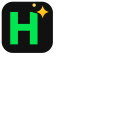
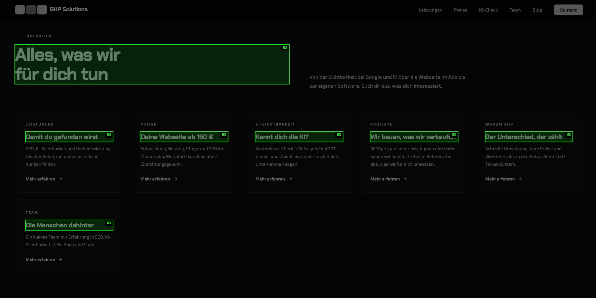

# Headings Highlighter

A small Chrome extension that highlights every heading (`<h1>`–`<h6>`) on the current page, so you can check a page's heading structure at a glance.

## What it does

Click the extension icon in the toolbar to toggle the highlights on or off:

- The page is dimmed and turned grayscale.
- Every visible heading gets a green outline with a label showing its level (`H1`, `H2`, …).
- Hidden headings are skipped, for example headings in closed modals, cookie banners slid off-screen, or screen-reader-only headings.
- Highlights follow the page as it scrolls, resizes, loads more content, or opens and closes modals.
- The overlay covers the whole page, so it also shows up in full-page screenshots (for example with GoFullPage).

## Install in Chrome

The extension isn't in the Chrome Web Store, so you load it as an unpacked extension:

1. Download or clone this repository.
2. Open `chrome://extensions` in Chrome.
3. Turn on **Developer mode** (top right).
4. Click **Load unpacked** and select the repository folder (the one containing `manifest.json`).
5. Optional: open the puzzle-piece menu in the toolbar and pin **Headings Highlighter**.

After you change the code, click the reload button ↻ on the extension's card in `chrome://extensions`, then reload the page you're testing.

## Usage

1. Open any website.
2. Click the Headings Highlighter icon. The headings are highlighted.
3. Click the icon again to remove the highlights.

Chrome doesn't allow extensions to run on its own pages (`chrome://…`) or on the Chrome Web Store, so the icon does nothing there.

## Permissions

- `activeTab`: access only to the tab you click the icon on, and only at that moment.
- `scripting`: to inject the highlight script into that tab.

The extension doesn't collect or send any data.

## Files

| File | Purpose |
| --- | --- |
| `manifest.json` | Extension manifest (Manifest V3) |
| `background.js` | Injects `highlight.js` into the tab when the icon is clicked |
| `highlight.js` | Draws the overlay and heading highlights, and toggles them off again |
| `icons/` | Toolbar and store icons (`icon.svg` is the source) |
| `screenshots/` | Preview image used in this README |
